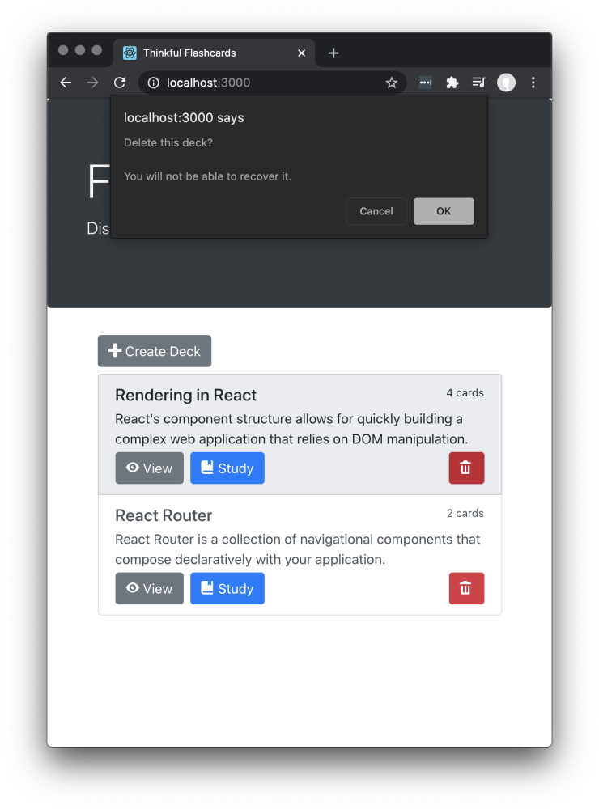
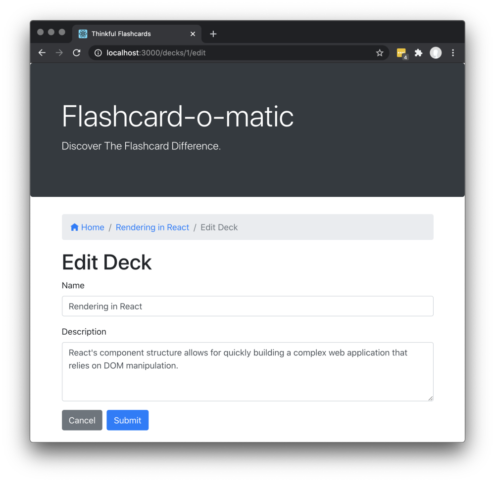
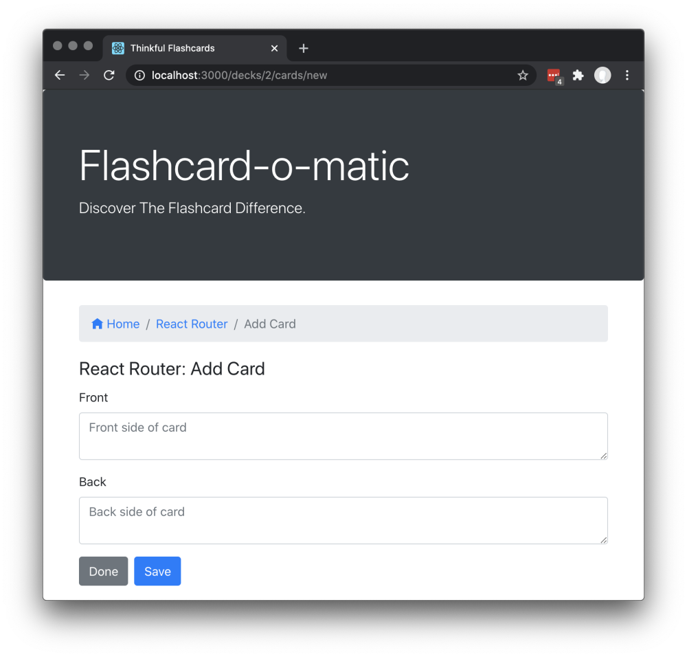

# Flashcard App

This project was made for users studying to be able to create a deck of flashcards. Using flashcards can be a very effective studying approach. Flashcards are often part of spaced practice, and repetition helps you figure out what information you can remember easily and what needs additional effort.

## Motivation

This was created as part of my project for the Thinkful Software Engineering course. This project helped me a lot in learning and practicing React and React hooks. I hope to one day come back to this project and add styling to it.

## Technology

Built with

- Javascript
- HTML
- CSS
- React/React Hooks
- React Router
- Bootstrap

## Features

- Create a deck
- Create cards for the deck
- View, Study, Edit, Delete Decks
- Flip cards within a deck

## Installation

1. Fork and clone this repository
2. Run `npm install` to install project dependencies
3. Run `npm start` to start the project
4. The start command will start two servers concurrently:

- An API server, powered by json-server, running on http://localhost:5000
- A React application running on http://localhost:3000

If you have trouble getting the server to run, feel free to reach out to me!

## Screenshots

## Contributing

Pull requests are welcome. For major changes, please open an issue first to discuss what you would like to change.

Please make sure to update tests as appropriate.

## Credits

@ [Thinkful](https://github.com/Thinkful-Ed)

## Author

[Anon Vanichyanukroh](https://github.com/avthedev)
